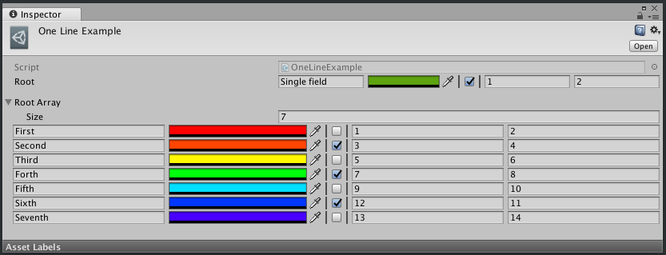

# Overview

OneLine improves your databases and makes it more readable by people. It draws objects in Inspector into one line instead default line-by-line style. Also it provides a few features like fields highlightning, locking array size, etc...

# Get started or TL;DR

- After importing look at `Assets/Example/Example.asset` and open in in InspectorWindow. It will show you all capabilities of OneLine library.
- In your code, add `using OneLine;` and add **OneLineAttribute** to fields you want to draw into one line. Note that internal fields don't need **OneLineAttribute**: they will processed automatically.
- If you want to customize onelined fields, use **Width**, **Weight**, **HideLabel**, **Highlight**, **HideButtons** and **ArrayLength** attributes (see **Example.asset**).

# Details

## [OneLineAttribute]

`[OneLineAttribute]` is the core of all library. Add it to any field drawen in Inspector and its view will be chanded: it with all children will be drawen into one line (and arrays with all elements and their children). It works fully recursive and automatic. You don't need to add `[OneLine]` to every field -- just to root. `[OneLineAttribute]` uses all other attributes to customize view. But other attributes is just markers and containers for settings (for example, `[WeightAttribute]` tells to `[OneLineAttribute]` that this field must me wery long, but it is not draws anything be itself). Except `[SeparatorAttribute]`: it is used as marker and as drawer depends on context.

```csharp
[CreateAssetMenu]
public class Example : ScriptableObject {
    [SerializeField, OneLine]
    private ThreeFields threeFields;

    [Serializable]
    public class ThreeFields {
        [SerializeField]
        private string first;
        [SerializeField]
        private string second;
        [SerializeField]
        private string third;
    }
}
```

Produces following result: 


## [WeightAttribute]

`[WeightAttribute]` allows you to manage relative sizes of fields. For example, if class contains two fields: short integer ID and long string UUID, you can use `[Weight]` to set UUIDs length equals 8 IDs lenghtes.  
Note that values of `[WidthAttribute]` and `[WeightAttribute]` are summarized: you cat set weight=2 and width=25 and field will be as two simple fields plus 25.

```csharp
[CreateAssetMenu]
public class Example : ScriptableObject {
    [SerializeField, OneLine]
    private Weights differentWeights;

    [Serializable]
    public class Weights {
        [SerializeField, Weight(3)]
        private int first;
        [SerializeField, Weight(2)]
        private int second;
        [SerializeField, Weight(1)]
        private int third;
    }
}
```

Produces following result: 


## [WidthAttribute]

`[WidthAttribute]` is same as `[WeightAttribute]` but operates with fixed widthes. It allows you to set fields width equals 50. And it will. It uses GUI units (like all property drawers). It set Weight of field to 0 (zero), but you can change it with `[WeightAttribute]`.
Note that values of `[WidthAttribute]` and `[WeightAttribute]` are summarized: you cat set weight=2 and width=25 and field will be as two simple fields plus 25.

```csharp
[CreateAssetMenu]
public class Example : ScriptableObject {
    [SerializeField, OneLine]
    private WidthAndWeight fixedWidth;

    [Serializable]
    public class WidthAndWeight {
        [SerializeField, Width(75)]
        private string first;
        [SerializeField]
        private string second;
        [SerializeField, Weight(2), Width(25)]
        private string third;
    }
}
```

Produces following result: 


## [HideLabelAttribute]

`[HideLabelAttribute]` allows you to hide prefix label in view. It is useful to prevent width looses and draw your data in whole line. See example:

```csharp
[CreateAssetMenu]
public class Example : ScriptableObject {
    [SerializeField, OneLine, HideLabel]
    private ThreeFields thisSelfDocumentedFieldNameWillNotBeShownInTheInspector;

    [Serializable]
    public class ThreeFields {
        [SerializeField]
        private string first;
        [SerializeField]
        private string second;
        [SerializeField]
        private string third;
    }
}
```

Produces following result: 

